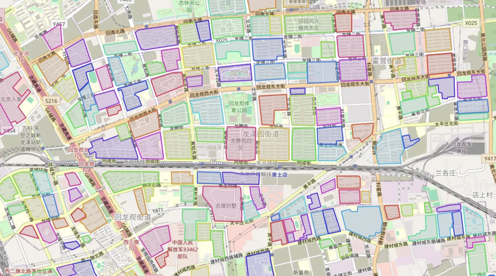

# Spatial Decision Intelligence

**The trusted spatial world model integrity layer and decision readiness gate for enterprise decision engines.**

`TRUSTED WORLD STATE` · `DECISION READINESS` · `4-AGENT ARCHITECTURE` · `EXPLAINABLE DIAGNOSIS` · `HUMAN-GOVERNED` · `MIT`

> **Core Question:** Before optimizing territories, visit plans, store coverage, or delivery networks, the system answers a fundamental prerequisite:  
> **Is the spatial world represented by the data trustworthy enough to make an automated decision?**

Spatial Decision Intelligence transforms inconsistent coordinates, broken geofences, and ambiguous spatial entities into verified, traceable **spatial facts (Trusted Spatial State)** that downstream decision solvers can safely consume without inheriting silent spatial corruption.

The current production-validated scenario is **Geofence Integrity**: 9,039 operational fences run end-to-end; see [Empirical Evidence](#6-empirical-evidence-9039-operational-fences-validated).

---

## 1. Product Positioning & System Architecture

This project adopts a two-tier product hierarchy:

```text
Spatial Decision Intelligence (Platform Vision)
└── Spatial World Model Integrity Engine (Current Core Product: Spatial Integrity Layer)
    └── Geofence Integrity (Scenario #1: Validated Production Scenario)
```

### Position in the TopPrism Decision OS

Under TopPrism's SVDE reference architecture (*Agent is Interface, Protocol is Runtime*), this project operates as the foundational spatial gate preceding semantic compilation and optimization solvers:

```text
Enterprise Spatial Reality
Stores, Fences, Coordinates, Roads, Territories, Operational Exports
                  │
                  ▼
┌─────────────────────────────────────────────────────────┐
│ Spatial World Model Integrity Layer (This Project)      │
│ Pre-Decision Diagnostic Gate                            │
│                                                         │
│ · Coordinate Alignment: WGS-84 / GCJ-02 offset repair   │
│ · Geometric QA: Self-intersection healing, MIC strips   │
│ · Entity Resolution: Spatial overlap + BGE Cross-Encoder│
│ · Readiness Gates: Fail-Closed quarantine, 3-tier queue │
└────────────────────────────┬────────────────────────────┘
                             │ Trusted Spatial State
                             ▼
┌─────────────────────────────────────────────────────────┐
│ Decision Semantic Layer                                 │
│ Compiles business objectives into formal spatial bounds │
└────────────────────────────┬────────────────────────────┘
                             ▼
┌─────────────────────────────────────────────────────────┐
│ Decision Compiler & Solvers                             │
│                                                         │
│ · Visit Scheduling (visit-scheduling-optimizer)         │
│ · Territory Partitioning (market-partition)             │
│ · Dispatch Routing (open-dispatch)                      │
│ · Store Potential (themed-street-engine)                │
└────────────────────────────┬────────────────────────────┘
                             ▼
               Execution → Outcome → Decision Memory
```

This means the engine does not answer *"How should geofences be drawn?"*, but rather:  
**"Is the spatial world seen by the decision engine genuine, unified, conflict-free, and ready for automated decision making?"**

---

## 2. Core Architecture: 4-Agent Spatial Intelligence Platform

Community fence generation is not about asking an LLM to hallucinate a polygon—it is an **entity understanding and spatial evidence reasoning process**. The system orchestrates 4 specialized agents:

```text
               [ Input: Community Name + Address + Seed Point ]
                                      │
                                      ▼
┌──────────────────────────────────────────────────────────────────────────┐
│              Spatial Intelligence Agent Platform (4-Agent Layer)         │
│                                                                          │
│  🏢 Agent 1: Entity Resolution Agent                                     │
│     · Semantic component gates (Base, Court, Phase, Subarea)             │
│     · Entity scale inference (Courtyard ~2k m² vs Community ~30k m²)     │
│                                      │
│                                      ▼
│  🗺️ Agent 2: Boundary Reasoning Agent                                     │
│     · Spatial context: Search bbox, target area prior, adaptive zoom     │
│     · Emits formal BoundaryConstraints packet                            │
│                                      │
│                                      ▼
│  📐 Agent 3: Geometry Generation Agent & Candidate Fusion                │
│     · Multi-hypothesis: [Road Block] + [Building Hull] + [Area Buffer]   │
│     · Spatial Reasoning Scorer: Point, area alignment, compactness       │
│     · Synthesizes optimal physical polygon boundary                      │
│                                      │
│                                      ▼
│  🛡️ Agent 4: Geometry QA Agent                                           │
│     · Health checks: Self-intersection healing, MIC narrow strips        │
│     · Decision Readiness Gate: Auto-degrades to Route A on severe defect │
└─────────────────────────────────────┬────────────────────────────────────┘
                                      │
                                      ▼
                      [ Trusted Spatial State ]
                      (Published to territory, visit, and dispatch solvers)
```

---

## 3. What It Is NOT

To establish rigorous engineering and academic boundaries, this engine explicitly is:

1. **NOT a General-Purpose GIS Viewer**: Visualizing points on a map is a diagnostic side-effect, not the core deliverable;
2. **NOT an Automatic-Merging MDM**: Operates under an absolute **zero false-merge policy** (0 silent merges); all entity ambiguities are routed to human review with evidence packets;
3. **NOT a Downstream Territory/Routing Optimizer**: Does not replace solvers like `market-partition` or VRP engines, but acts as their **pre-solver gate (Fail-Closed Gate)**;
4. **NOT Claiming All Spatial Domains Are Solved**: Validated on **Geofence Integrity**; channel disputes, dynamic mobility, and market white-spaces remain on the evolution roadmap.

---

## 4. Decision-Readiness Contract

Before spatial facts can be consumed by downstream solvers, they must satisfy a 6-dimensional readiness contract:

| Contract Dimension | Pre-Decision Question | Current Capability | Fail-Closed Policy |
| :--- | :--- | :---: | :--- |
| **Coordinate Trust** | Are points, polygons, and roads in a unified spatial reference datum? | ✅ Validated | 7-parameter transform; unaligned entities **Quarantined** |
| **Geometric Trust** | Are polygons topologically valid, non-self-intersecting, and non-sliver? | ✅ Validated | `make_valid` healing; degenerate slivers **Blocked** |
| **Entity Trust** | Are similar records identical entities, sibling phases, or distinct? | ✅ Validated | Component gates + Cross-Encoder re-ranking |
| **Relational Trust** | Is there ground double-counting, abnormal overlap, or collision? | ✅ Validated | IoU + semantic re-ranking into 3-tier work orders |
| **Decision Applicability** | Does the output satisfy consumer solver input schemas? | ✅ Validated | Downstream Adapters (Territory / Visit / Coverage) |
| **Temporal Freshness** | Does the data reflect recent ground physical reality? | Roadmap | Planned (Satellite change detection) |

---

## 5. Diagnostic Reasoning: From Finding to Disposition

Diagnostic outputs follow a strict structural pipeline:  
**Finding $\rightarrow$ Evidence $\rightarrow$ Impact $\rightarrow$ Recommended Review $\rightarrow$ Disposition**

```text
Finding
  └─ Example: Geofence SRC_0042 is a degenerate narrow sliver (MIC diameter 7.1m, length 340m)
Evidence
  └─ Rule: MAXIMUM_INSCRIBED_CIRCLE < 50m; Metrics: max_w=7.1m, mean_w=4.2m, length=340m
Impact
  └─ Blocked Solvers: [market-partition, open-dispatch]; Consequence: Distorts territory capacity by 80%
Recommended Review
  └─ Human review needed to determine whether geometry represents roadside retail strip or digitizing error
Disposition
  └─ Reviewer action: [CONFIRM_REPAIR / SPLIT / QUARANTINE] ──► Fed back into Decision Memory
```

---

## 6. Empirical Evidence (9,039 Operational Fences Validated)

Validated across 9,039 operational enterprise geofences (Beijing 7,431 + Shijiazhuang 1,608):

| Diagnostic Claim | Measured Empirical Evidence | Status |
| :--- | :--- | :---: |
| **Systematic CRS Alignment** | 8,332 WGS-84 point vs GCJ-02 polygon offsets corrected; 505 missing points rebuilt from centroid | **Validated** |
| **Topology Knot Healing** | 539 self-intersecting / bowtie polygons 100% healed automatically | **Validated** |
| **Industrial Narrow-Strip Detection** | 838 degenerate slivers identified via Maximum Inscribed Circle (MIC), replacing 70%-false-positive aspect ratio rules | **Validated** |
| **Cross-Encoder Disambiguation** | 4,931 soft candidate pairs re-scored with BGE Cross-Encoder on Apple Silicon MPS (410s total runtime) | **Validated** |
| **Tiered Work-Order Routing** | Tier 1 (Critical Overlap): 1,311 / Tier 2 (Standard Soft): 2,808 / Tier 3 (Filtered): 8,907 | **Validated** |
| **Zero False-Merge Red Line** | Exact 0 automatic merges executed; 100% human-governed | **Validated** |

> **What the Evidence Does NOT Claim (Counter-Evidence Boundaries):**  
> 1. Evidence proves the effectiveness of data diagnosis and readiness gating, **not that downstream territory allocations are automatically optimal**;  
> 2. Weak-supervision AI self-drawing is in dataset preparation (7,630 satellite patches) and exploratory benchmarking; it does not replace operational procurement.

---

## 7. Quick Start

Run on a clean machine without private dependencies:

### 1. Environment Setup

```bash
git clone https://github.com/topprismdata/spatial-decision-intelligence.git
cd spatial-decision-intelligence

python3 -m venv .venv
source .venv/bin/activate

pip install -e .
```

### 2. Run 4-Agent Spatial Reasoning & Fence Generation

```bash
# Execute 4-Agent reasoning pipeline for a community brief
spatial-di generate "万科星河湾二期" \
  --address "朝阳北路88号" \
  --lng 116.452 \
  --lat 39.921 \
  --area 32000 \
  --output-geojson outputs/vanke_demo.geojson
```

### 3. Run Synthetic Benchmark Diagnosis

```bash
# Diagnose bundled 30-fence synthetic benchmark capturing real degradation modes
spatial-di diagnose examples/sample_fences.geojson

# Or diagnose custom Excel / GeoJSON datasets
spatial-di diagnose /path/to/your/fences.xlsx --output-dir outputs/
```

### 4. Launch Multi-City Case Inspector

```bash
# Open interactive case inspector with 3-tier filtering & CSV export
open outputs/interactive_inspector.html
```

---

## 8. License & Project Structure

* **License**: [MIT License](LICENSE)
* **Key Components**:
  * `src/agents/`: 4-Agent Layer (`EntityResolution`, `BoundaryReasoning`, `GeometryGeneration`, `GeometryQA`, `SpatialIntelligencePlatform`);
  * `src/generation/candidate_fusion.py`: Multi-hypothesis candidate generation & spatial reasoning scorer;
  * `src/domain/world_model.py`: Formal Spatial World Model contracts (`SpatialEntity`, `QualityFinding`, `DecisionImpact`, `TrustedSpatialState`);
  * `src/adapters/decision_adapters.py`: Fail-Closed adapters for downstream solvers (`TerritoryPlanning`, `VisitScheduling`, `CoverageAnalysis`);
  * `src/geometry/ai_fence_guard.py`: Quality gate & graceful fallback guard for AI-generated geometries;
  * `src/cli.py`: Unified `spatial-di` command-line tool.

---

## 9. Beijing Residential Open-Data Benchmark (R0–R13)

> **目标：** 仅使用免费开放数据，评估北京住宅空间实体发现、边界重建与可信状态发布能力。
> **状态：** R0–R13 全部闭环，24 个可行动失败域 100% 解决。 [完整报告](docs/final-progress-report-r0-r13.md)

### 核心成果

| 指标 | 值 |
|:---|:---|
| 基准 Case | 30 个北京真实住宅 (BJ-RS-0001 ~ BJ-RS-0030) |
| 备用 Case | 12 个 |
| 实验运行 | 360 次 Primary Runs (30 Case × 12 实验) |
| 数据源 | Geofabrik OSM (11,227 住宅多边形), Overture, Microsoft Buildings |
| 失败域消解 | 24 个可行动 → **0 个** |
| 误报可信 | 0 (False Trusted = 0) |

### 在线交互地图（GitHub Pages）

**[🌐 打开交互地图：回龙观城市建设分类 + 小区画像](https://topprismdata.github.io/spatial-decision-intelligence/interactive_map.html)**

- GB50137 九大类 651 地块全量标记（居住/商业/办公/工业/教育/医疗/体育/公园/交通）
- 点击地块查看：类别、户数、挂牌均价、医院等级、建成年代
- 双底图切换：OSM（对齐）/ 高德
- 离线版：[`docs/offline.html`](https://topprismdata.github.io/spatial-decision-intelligence/offline.html)（260KB 单文件，无需联网）



*基于 Geofabrik OSM 数据，181 个有名称住宅用地 + 9 个无名称地块。彩色多边形为有名称住宅用地，灰色为无名称地块。*

### 迭代阶段

| 阶段 | 内容 | 状态 |
|:---|:---|:---:|
| R0 | 纠偏与成熟度评估 | ✅ |
| R1 | Metric CRS (EPSG:32650 UTM 50N) | ✅ |
| R2 | 4 个 Baseline Provider | ✅ |
| R3 | Validation Gate (4 Gate) | ✅ |
| R4 | 30-Case 选择与盲审 | ✅ |
| R5 | Gold Adjudication (G1–G8) | ✅ |
| R6 | B0–B7 Open-Data Benchmark (360 runs) | ✅ |
| R7 | Failure Analysis (D1–D8) | ✅ |
| R8 | Road Semantics (VLM verified) | ✅ |
| R9 | Building Membership (evidence-driven) | ✅ |
| R10 | Targeted Re-benchmark | ✅ |
| R11 | Shared Topology (evidence-aware) | ✅ |
| R12 | Entity Resolution (hierarchy disambiguation) | ✅ |
| R13 | Candidate Generation (full data coverage) | ✅ |

### R14 规划（文献驱动优化，已立项）

基于 8 维度学术文献普查的 Top-5 优化清单（详见 [R14 提案](docs/r14-lit-review-optimization-proposal.md)）：

| # | 改进 | 收益 | 复杂度 |
|:-:|:---|:---|:-:|
| P1 | 凸包 → Alpha shape (concave hull) | L 形小区 IoU 上限 0.65 → 0.85 | M |
| P2 | 高德覆盖基准 Gate（无名 + 无 POI ⇒ REJECTED） | 消除 ~4,900 农地误标 | S |
| P3 | 启发式排序 → Dempster-Shafer 证据融合 | False Trusted 数学保证 | L |
| P4 | 共享边修复 → Planar Partition 重建 | watertight 输出 | L |
| P5 | 层级解析 + Amap gazetteer 校验 | 同名 Phase 歧义消解 | S |

**全量实测 (2026-08-27)：** 北京 11,227 个 OSM 住宅用地已跑通 4-Provider Pipeline（874s / 0 错误），Amap 补名 +285 个，最终可信围栏 ~6,600 个。

### 数据源

| 来源 | 用途 | 许可证 |
|:---|:---|:---|
| Geofabrik OSM Beijing | 道路、建筑、土地利用 | ODbL |
| Overture Maps | 建筑、交通、场所 | 按主题 |
| Microsoft Buildings | 建筑 footprint | CDLA Permissive 2.0 |

---

## 10. 北京 A 级景区 + 学校围栏

### 北京学校围栏 (2,814 所)

**[🌐 在线查看：北京学校围栏地图](https://topprismdata.github.io/spatial-decision-intelligence/schools_map.html)**

基于 Geofabrik OSM `pois_a` 教育类面层，所有学校均为精确 Polygon 围栏（非点标记）：

| 类型 | 数量 |
|:---|---:|
| 中小学 | 1,878 |
| 幼儿园 | 605 |
| 大学 | 173 |
| 学院 | 158 |
| **合计** | **2,814** |

点击地块查看：名称、类型、面积。按面积从大到小渲染。

### 北京 A 级景区边界 (189 个)

**[🌐 打开景区地图](https://topprismdata.github.io/spatial-decision-intelligence/scenic_spots_map.html)**

- 204 条名录，180 个定位成功（88%）
- 边界来源：OSM 面匹配 (66) / 卫星+路网构造 (123)
- **已知问题：** CONSTRUCTED 边界为近似范围（IoU ~0.4），已标注 KNOWN_ISSUE
